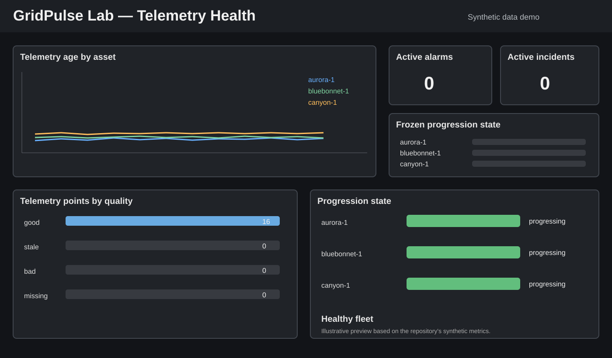

# GridPulse Lab

[](https://github.com/VITA2aishu/gridpulse-lab/actions/workflows/ci.yml)
[](https://www.python.org/)
[](LICENSE)

An open-source, dependency-free lab for learning how real-time grid and battery
energy storage telemetry behaves when measurements become stale, frozen, invalid
or unavailable.

> **Safety note:** GridPulse Lab uses generated data and fictional assets. It
> contains no employer data, production endpoints or proprietary configuration.

## Why it exists

Operational energy systems are difficult to learn without access to a control
room. GridPulse Lab makes the important concepts reproducible on a laptop:

- battery state of charge, active/reactive power and frequency;
- telemetry freshness, progression and data-quality evaluation;
- alarm lifecycle and synthetic incident injection;
- a live operations dashboard and documented JSON API;
- Prometheus metrics plus a starter Grafana telemetry-health dashboard.

The longer-term health model goes beyond service uptime and focuses on five
signals: **freshness, progression, connectivity, processing lag and data
quality**. See the [public roadmap](ROADMAP.md) for planned releases and
contribution opportunities.

## Dashboard preview



The starter Grafana dashboard visualizes telemetry age, active alarms, synthetic
incidents, point quality, and progression state for the fictional fleet. The
preview is illustrative; live values come from the `/metrics` endpoint when the
lab is running.

## Quick start

```bash
python -m gridpulse.server
```

Then open <http://localhost:8080>. For source checkouts without installation:

```bash
PYTHONPATH=src python -m gridpulse.server
```

Run the test suite:

```bash
PYTHONPATH=src python -m unittest discover -s tests -v
```

## Observability quick start

Prometheus-format metrics are available at:

```text
http://127.0.0.1:8080/metrics
```

A starter Prometheus scrape file and an importable Grafana dashboard live under
[`examples/`](examples/). See the [observability quick start](docs/observability.md)
for setup instructions and a frozen-stream demonstration.

## Project status

The current lab includes a live three-asset fictional fleet, injectable failure
scenarios, freshness and progression detection, quality evaluation, derived
alarms, a responsive dashboard, Prometheus metrics and automated tests.

Upcoming work focuses on processing lag, combined data-health scoring,
configurable assets and additional community observability examples. See the
[open issues](https://github.com/VITA2aishu/gridpulse-lab/issues) if you would
like to contribute.

## API

| Endpoint | Purpose |
|---|---|
| `GET /api/v1/health` | Service readiness |
| `GET /api/v1/telemetry` | Fleet snapshot, quality and progression summaries, and alarms |
| `GET /api/v1/incidents` | Active training incidents |
| `POST /api/v1/incidents` | Activate an incident |
| `DELETE /api/v1/incidents/{asset_id}` | Clear an incident |
| `GET /metrics` | Prometheus telemetry-health metrics |

See the [API reference](docs/api.md), [architecture](docs/architecture.md), and
[observability guide](docs/observability.md).

## Roadmap

- data-health scoring across freshness, progression, connectivity, lag and quality;
- time-series history and incident replay;
- processing-lag telemetry and observability;
- configurable fictional assets;
- community-contributed training and monitoring scenarios.

Full details are tracked in [ROADMAP.md](ROADMAP.md).

Contributions are welcome. Start with the safety requirements and suggested
beginner issues in [CONTRIBUTING.md](CONTRIBUTING.md).

## License

[MIT](LICENSE)
