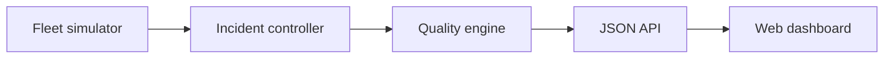

# Architecture

GridPulse Lab deliberately starts with a small dependency-free architecture so
learners can trace every telemetry point from generation to presentation.

## Data flow

1. `FleetSimulator` produces a snapshot of fictional BESS measurements.
2. `IncidentController` modifies selected measurements for training scenarios.
3. `QualityEngine` evaluates freshness, presence and engineering ranges.
4. The HTTP service serializes the snapshot under `/api/v1/telemetry`.
5. The browser polls every two seconds and renders fleet and signal health.

The simulator is deterministic when supplied with the same random seed. This
makes incidents reproducible and keeps automated tests reliable.

## Sign convention

Positive active power represents discharge to the grid. Negative active power
represents charging from the grid. State-of-charge change follows the simplified
energy relation:

$$\Delta SOC = -\frac{P \times \Delta t}{E} \times 100$$

This release omits efficiency losses, degradation and market dispatch. These are
useful, well-bounded areas for future contributions.

## Security and scope

The service is a local learning lab, not a control system. It has no authentication
or authorization and must not be connected to operational technology networks.

